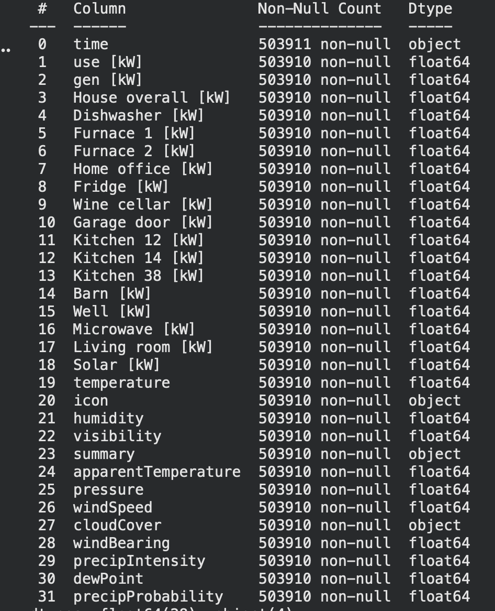

# SmartHome-Energy-Classifier
Bu proje Makine Öğrenmesine Giriş dersi kapsamında geliştirilmiştir.

## Projenin Amacı
Bulaşık makinesi, fırın gibi evin içindeki cihazların anlık sensör verilerine ihtiyaç duymadan, yalnızca Hava Durumu (sıcaklık, nem, rüzgar) ve Zaman parametrelerini kullanarak evin enerji tüketim seviyesini Yüksek veya Düşük olucak şekilde tahmin etmektir. Proje, sadece anlık dış faktörlere dayanmakla kalmayıp, Pivot Tablolar aracılığıyla hesaplanan ve evin farklı saat/hava koşullarındaki normal tüketim alışkanlıklarını temsil eden referans (baseline) verilerini de modele dahil ederek, geçmiş davranış desenleri ile dış etkenleri birleştiren hibrit bir makine öğrenmesi yaklaşımı sunmaktadır.

## Veri Seti ve Ön İşleme
### Veri Seti
Projede kullanılan veri seti, bir akıllı evin enerji tüketim alışkanlıklarını ve bu tüketimi etkileyebilecek çevresel faktörleri içeren yaklaşık 503.000 satırlık kapsamlı bir veri setirdir.

### Uygulanan Ön İşleme Adımları
#### Zaman Dönüşümü
Ham veride "Unix Timestamp" formatında bulunan zaman bilgisi, mevsimsel ve döngüsel analizlere (saatlik/günlük trendler) imkan tanıyan datetime formatına dönüştürülmüştür.

#### Eksik Veri Tamamlama Meteorolojik verilerdeki (örneğin cloudCover) boş veya hatalı değerler, hava durumunun zamansal sürekliliği ve fiziksel tutarlılığı göz önüne alınarak "Forward Fill" yöntemiyle (bir önceki saatin verisiyle) tamamlanmıştır.

#### Encoding
summary (Hava durumu özeti) gibi metinsel ifadeler içeren kategorik sütunlar, modellerin matematiksel olarak işleyebilmesi için LabelEncoder yöntemiyle sayısal değerlere dönüştürülmüştür.

#### Scaling (Ölçeklendirme)
Sıcaklık (20°C) ve basınç (1013 mbar) gibi farklı birim ve ölçeklerdeki verilerin modelleri (özellikle KNN ve Logistic Regression) yanıltmaması için StandardScaler kullanılarak veriler standart normal dağılıma çekilmiştir.

## Kullanılan Modeller ve Performans Analizi
Proje kapsamında, problemin doğasına en uygun algoritmayı belirlemek amacıyla üç farklı makine öğrenmesi yaklaşımı karşılaştırılmıştır:

### Random Forest
Veri setindeki karmaşık ve lineer olmayan ilişkileri yakalayabilen, aşırı öğrenmeye (overfitting) karşı dirençli bir topluluk (ensemble) öğrenme modelidir.

### Logistic Regression
Sınıflar arasındaki olasılıksal ilişkiyi modelleyen temel ve güçlü bir lineer sınıflandırıcıdır.

### K-Nearest Neighbors (KNN) 
Veri noktalarının birbirine olan uzaklığına (Eucledian distance) dayanarak sınıflandırma yapan mesafe tabanlı bir algoritmadır.
